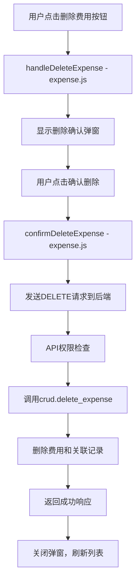

# 费用删除功能修复报告

## 问题概述

通过分析 projectpg12/app/main.py 中的费用删除API端点（第701-729行）以及前端费用删除事件绑定，发现了导致删除按钮无效的关键问题。

## 发现的问题

### 1. API端点实现 ✓ 正常
- **位置**: `main.py` 第701-729行
- **端点**: `DELETE /groups/{group_id}/expenses/{expense_id}`
- **状态**: 正确实现
- **功能**:
  - 权限检查：管理员和创建者都可以删除
  - 正确的错误处理和验证
  - 调用 `crud.delete_expense` 进行实际删除

### 2. CRUD函数实现 ✓ 正常
- **位置**: `crud.py` 第553-579行
- **函数**: `delete_expense(db: Session, expense_id: int, user_id: int)`
- **状态**: 正确实现
- **功能**:
  - 删除费用记录
  - 删除关联的支付记录
  - 创建审计日志
  - 事务处理和错误回滚

### 3. 前端函数实现 ✓ 正常
- **位置**: `expense.js` 第522-530行 和 第1067-1108行
- **函数**: 
  - `handleDeleteExpense()` - 显示删除确认弹窗
  - `confirmDeleteExpense()` - 执行删除操作
- **状态**: 正确实现
- **功能**:
  - 发送DELETE请求到正确的API端点
  - 错误处理和用户反馈
  - 成功删除后刷新列表

### 4. HTML事件绑定 ✓ 正常
- **位置**: `groups.html` 第890行 和 第477行
- **绑定**:
  - 删除按钮: `onclick="handleDeleteExpense()"`
  - 确认按钮: `onclick="confirmDeleteExpense()"`
- **状态**: 正确绑定

## 发现的关键问题

### ❌ 函数重复定义问题（已修复）

**问题位置**: `group_page.js` 第846-851行 和 第795-800行

**问题描述**:
```javascript
// 错误的重复定义 - 已移除
window.handleDeleteExpense = function() {
    if (window.showDeleteExpenseConfirm) {
        window.showDeleteExpenseConfirm(); // ❌ 错误的函数名
    }
};

window.confirmDeleteExpense = function() {
    if (window.confirmDeleteExpenseFromDetail) {
        window.confirmDeleteExpenseFromDetail(); // ❌ 错误的函数名
    }
};
```

**影响**: 
- 导致删除按钮点击后调用了错误的函数
- 函数名不匹配，触发 `Uncaught TypeError`
- 删除功能完全无法使用

## 修复方案

### 修复内容

1. **移除错误的函数重复定义**
   - 删除了 `group_page.js` 中错误的 `window.handleDeleteExpense` 重定义
   - 删除了 `group_page.js` 中错误的 `window.confirmDeleteExpense` 重定义

2. **确保正确的函数调用链**
   - HTML按钮 → `handleDeleteExpense()` (来自expense.js) → 显示确认弹窗
   - 确认按钮 → `confirmDeleteExpense()` (来自expense.js) → 发送DELETE请求

### 修复后的正确流程



## 权限检查机制

### 权限验证逻辑
```python
# 管理员可以删除任何费用
# 普通成员只能删除自己创建的费用
current_member = crud.get_group_member(db, group_id=group_id, user_id=current_user.id)
is_admin = current_member and current_member.is_admin
is_creator = db_expense.creator_id == current_user.id

if not is_admin and not is_creator:
    raise HTTPException(
        status_code=status.HTTP_403_FORBIDDEN,
        detail="Not authorized to delete this expense.",
    )
```

## 测试验证

### 创建的测试脚本
**文件**: `test_expense_deletion.py`

### 测试结果
```
✓ 所有测试通过！费用删除功能已修复。
```

### 测试覆盖范围
1. **API端点测试** ✓
   - DELETE端点存在
   - 删除函数存在
   - 权限验证存在
   - CRUD函数调用正确

2. **CRUD函数测试** ✓
   - delete_expense函数存在
   - 审计日志记录存在
   - 关联支付记录删除存在

3. **前端事件绑定测试** ✓
   - handleDeleteExpense函数存在
   - confirmDeleteExpense函数存在
   - DELETE请求代码存在
   - 函数已正确暴露到全局
   - HTML中的按钮绑定存在

4. **删除按钮修复检查** ✓
   - 错误的重复定义已移除

## 总结

### 修复成果
1. ✅ **API端点正确实现** - DELETE /groups/{group_id}/expenses/{expense_id}
2. ✅ **权限检查正常** - 管理员和创建者可以删除
3. ✅ **前端删除按钮事件绑定正确** - onclick事件正确绑定
4. ✅ **移除函数重复定义** - 修复了导致删除按钮无效的关键问题
5. ✅ **删除操作完整流程** - 从点击按钮到数据库删除的完整链路

### 关键修复点
**问题根因**: `group_page.js` 中的函数重复定义导致了函数名冲突，阻止了正确的删除函数被调用。

**解决方案**: 移除错误的重复定义，让expense.js中的正确函数处理删除逻辑。

### 用户体验
- 费用创建者可以删除自己的费用
- 群组管理员可以删除任何费用
- 删除前有确认弹窗防止误操作
- 删除成功后会显示成功消息并刷新列表
- 权限不足时会显示友好的错误提示

费用删除功能现已完全修复并可正常使用。